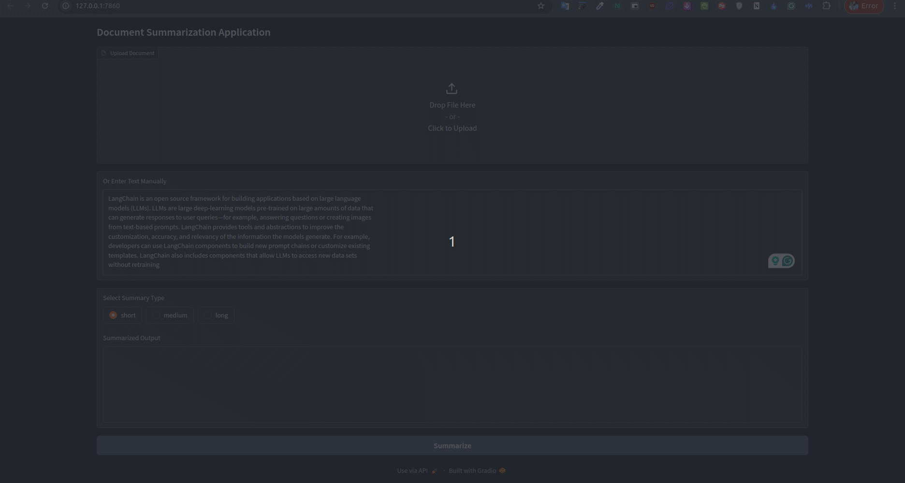

# Document Summarization Application

This project is a Document/Text Summarization application built using **LangChain** and **Gradio**. The application allows users to either upload documents (e.g., PDF files) or input text directly, and it generates a summary of the document based on the selected summary length (short, medium, long).

## Features
- **Document Upload**: Users can upload a document (currently supports PDF files) for summarization.
- **Text Input**: Users can manually input text to be summarized.
- **Multiple Summary Lengths**: Users can choose from three summary lengths:
  - Short
  - Medium
  - Long
- **Real-time Summarization**: After submitting the document or text, the summary is generated in real time and displayed on the web interface.

## Technology Stack

- **LangChain**: Used to handle language model chains for document summarization.
- **Gradio**: Provides an easy-to-use interface for uploading documents and interacting with the summarization feature.
- **OpenAI GPT-3.5-turbo**: The language model powering the summarization task.

## Prerequisites

Before you begin, ensure you have the following installed:

1. **Python 3.7+**
2. **pip** (Python package manager)

You will also need an **OpenAI API key** to access the language model used in this project. You can obtain one by signing up for an account at [OpenAI](https://platform.openai.com/).

## Final Result


## Installation

1. **Clone the Repository**:

   ```bash
   git clone https://github.com/yourusername/document-summarization-app.git
   cd document-summarization-app
   ```

2. **Install Dependencies**:

   Install the required Python packages using `pip`:

   ```bash
   pip install -r requirements.txt
   ```

   If you don’t have the `requirements.txt` file, you can manually install the required packages:

   ```bash
   pip install openai langchain gradio
   ```

3. **Set Up OpenAI API Key**:

   Set your OpenAI API key as an environment variable:

   ```bash
   export OPENAI_API_KEY="your-openai-api-key"
   ```

   Alternatively, you can set the API key directly in the code where it is initialized.

## Usage

1. **Run the Application**:

   After installation, you can start the application by running the following command:

   ```bash
   python app.py
   ```

2. **Access the Application**:

   Once the app is running, Gradio will launch a web interface. You will see a URL in the terminal (something like `http://127.0.0.1:7860/`). Open this URL in your browser to access the app.

3. **Upload Document or Input Text**:

   - You can either upload a document (PDF) by selecting the file or manually input text.
   - Choose the desired summary length: Short, Medium, or Long.
   - Click the **Summarize** button, and the summary will be displayed below.

## File Structure

```
.
├── app.py                # Main application file
├── README.md             # Project documentation (this file)
└── requirements.txt      # List of Python dependencies
```

## Example Screenshots

### Application Interface


### Example Summary Output


## Contributing

1. Fork the project.
2. Create a new branch (`git checkout -b feature-branch`).
3. Make your changes and commit them (`git commit -m 'Add some feature'`).
4. Push to the branch (`git push origin feature-branch`).
5. Open a Pull Request.

## License

This project is licensed under the MIT License. See the `LICENSE` file for details.

## Acknowledgments

- Thanks to [LangChain](https://langchain.com/) for the summarization framework.
- Thanks to [Gradio](https://gradio.app/) for the web interface.
- Powered by [OpenAI GPT-3.5](https://openai.com/).


